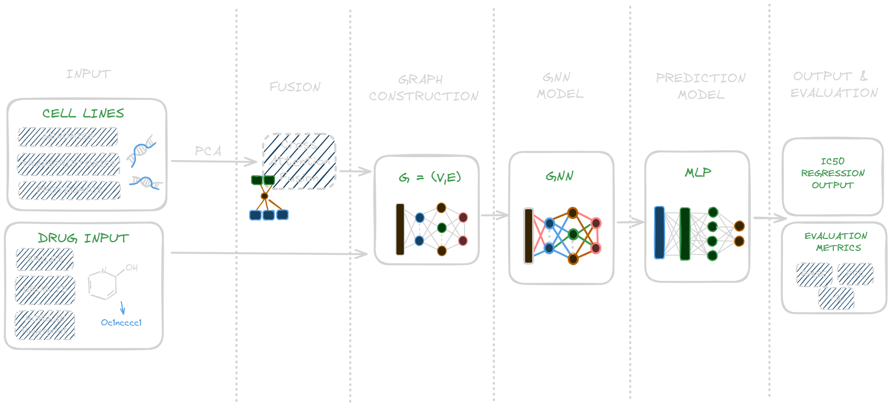

# Graph Neural Network-Based Multi-Omics Integration for Predicting Cancer Drug Response

This project asks two questions about predicting cancer cell-line drug sensitivity (LN(IC50)) from multi-omics data:

1. **Fusion:** Does learned **cross-attention fusion** combine omics types better than simply concatenating them?
2. **Graph:** Can a **heterogeneous graph neural network**, linking cell lines, drugs and proteins through the STRING protein–protein interaction network, use that biological structure to predict drug response?

Final Year Project (FIT3161, team MCS16), Monash University.

## Architecture



The planned final model has five stages:

1. **Inputs**
   - Cell lines: gene expression, mutations + copy-number variation, and proteomics. Each is imputed, z-scored and PCA-reduced to 128 dimensions.
   - Drugs: SMILES strings from PubChem, turned into Morgan fingerprints with RDKit (a one-hot drug ID is also tested).
2. **Fusion:** multi-head cross-attention combines the omics types into one cell-line embedding.
3. **Graph construction:** a heterogeneous graph built with PyTorch Geometric.
   - Nodes: cell lines, drugs and proteins.
   - Edges: protein–protein (STRING v12), drug → target protein, and cell line → mutated gene.
4. **GNN:** two heterogeneous GraphSAGE layers pass messages across the graph.
5. **Prediction:** the cell-line and drug embeddings are joined and passed to an MLP that predicts IC50. Models are scored with RMSE, PCC and R².

> **Current status:** stages 2 and 3 are not connected yet. The GNN's cell-line nodes currently use the concatenated PCA features. The next step is to feed them the cross-attention embeddings instead.

## Results

All 59 runs use the same cell-line-grouped 70/15/15 split (`random_state=42`, 532 cell lines with all three omics). Predicting the training-set mean gives RMSE 2.710; lower RMSE is better.

### 1. Cross-attention fusion vs. simple concatenation

Each row compares the two methods on the same omics and the same drug representation (test RMSE).

| Omics | Drug representation | Concatenation (MLP) | Cross-attention |
|---|---|---|---|
| GE + Mut/CNV + Proteomics | one-hot | 1.820 | **1.266** |
| Mut/CNV + Proteomics | one-hot | 1.921 | **1.281** |
| GE + Mut/CNV | one-hot | 1.849 | **1.296** |
| GE + Proteomics | one-hot | 1.513 | **1.244** |
| GE + Mut/CNV + Proteomics | fingerprint | 1.580 | **1.359** |
| GE + Proteomics | fingerprint | 1.452 | **1.321** |

Cross-attention wins every comparison, and its margin grows as more omics types are added. Concatenation gets worse as omics types are added, while cross-attention stays stable. Cross-attention on GE + Proteomics is the best model overall (RMSE 1.244, R² 0.788). See the [cross-attention ablation](docs/06_cross_attention_ablation_results.md).

### 2. Graph neural networks

These GNNs use concatenated cell-line features (see *Current status* above).

| Model | Omics | Drug representation | RMSE ↓ | PCC ↑ | R² ↑ |
|---|---|---|---|---|---|
| HeteroIC50GNN (GraphSAGE) | GE + Mut/CNV + Proteomics | fingerprint | **1.3301** | 0.8805 | 0.7682 |
| HeteroGNN (GraphSAGE, "GCN" variant) | GE + Mut/CNV + Proteomics | fingerprint | 1.3513 | 0.8757 | 0.7608 |
| HeteroGNN (GAT) | GE + Mut/CNV + Proteomics | fingerprint | 2.2546 | 0.5865 | 0.3341 |

With the same concatenated three-omics fingerprint input, the GNN beats the plain MLP (1.330 vs 1.580) and the random forest. That suggests the graph structure adds useful information. Adding cell line → mutated-gene edges also helped (1.401 → 1.351). GAT performed poorly. See the [GNN ablation](docs/07_gnn_ablation_results.md).

Full ranked table: [docs/results.md](docs/results.md). It is generated by `experiments/build_results_table.py`, so don't edit it by hand.

## Repository structure

```
backend/        FastAPI service the desktop app calls (dataset upload, model runs, results)
client/         HTTP client + Qt workers used by the GUI
pages/          GUI pages (dataset setup, execution log, results)
widgets/, styles/  Shared GUI components and theme
UILauncher.py   Desktop app entry point (PySide6)
src/data/       Ingestion, alignment, preprocessing and graph construction
src/models/     Model definitions; src/models/train/ holds the hetero-GNN training script
src/graph/      Serialised heterogeneous graph (hetero_graph.pt)
models/         Fitted PCA pipelines and trained checkpoints
experiments/    Numbered experiments (NN_*) with their result CSVs
docs/           Write-ups (NN_* matches experiments/NN_*), plans and reports
data/           raw/ (not tracked), aligned/, processed/ (generated)
```

## Setup

Requires Python 3.10+.

```bash
python -m venv .venv
source .venv/bin/activate        # Windows: .venv\Scripts\activate
pip install -r requirements.txt
```

For GPU training, install the CUDA build of PyTorch from [pytorch.org](https://pytorch.org/get-started/locally/) that matches your driver, then install PyTorch Geometric by following [its install guide](https://pytorch-geometric.readthedocs.io/en/latest/install/installation.html). The code is written to fit in 4–8 GB of VRAM.

## Data

Raw data is not tracked in git. Place the files under `data/raw/` using these paths:

| Path | Source |
|---|---|
| `ccle_depmap/model_list_20260724.csv` | [Cell Model Passports](https://cellmodelpassports.sanger.ac.uk/downloads) |
| `ccle_depmap/rnaseq_all_20260323.zip` | Cell Model Passports |
| `ccle_depmap/mutations_all_20260724.zip` | Cell Model Passports |
| `ccle_depmap/cnv_summary_20260316.zip` | Cell Model Passports |
| `ccle_depmap/Cell_lines_annotations_20181226.txt` | [DepMap / CCLE](https://depmap.org/portal/download/) |
| `auxiliary/Proteomics_20250211.zip` | Cell Model Passports |
| `gdsc/GDSC2_fitted_dose_response_27Oct23.xlsx` | [GDSC](https://www.cancerrxgene.org/downloads/bulk_download) |
| `gdsc/screened_compounds_rel_8.5.csv` | GDSC |
| `string/9606.protein.links.v12.0.txt.gz` | [STRING](https://string-db.org/cgi/download) |

Two more inputs are downloaded by scripts (see step 1 below): `string/9606.protein.aliases.v12.0.txt.gz` and `pubchem/gdsc_drug_smiles.csv`.

These datasets have their own licences and terms of use. Check each source before redistributing anything.

## Usage

Run every command from the repository root.

**1. Build the processed data and the graph**

```bash
python src/data/fetch_string_aliases.py
python src/data/fetch_drug_smiles.py
python src/data/ingest_and_align.py      # -> data/processed/aligned/
python src/data/build_wide_matrices.py   # -> data/processed/wide/
python src/data/00_run_preprocessing.py  # -> data/processed/*_pca.csv, models/omics_pca/
python src/data/03_graph_construction.py # -> src/graph/hetero_graph.pt
python src/data/04_link_cell_lines.py    # adds cell-line edges to the graph
```

**2. Train the heterogeneous GNN**

```bash
python src/models/train/05_train.py      # -> models/checkpoints/best_hetero_gnn.pt
```

**3. Reproduce the experiments**

```bash
python experiments/06_full_matrix/cross_attention_matrix.py   # for example
python experiments/build_results_table.py                     # regenerates docs/results.md
```

**4. Run the desktop app.** Start the backend first, then launch the GUI in a second terminal:

```bash
python -m backend.main   # FastAPI on http://127.0.0.1:8000
python UILauncher.py
```

## Experiments

| # | Experiment | Write-up |
|---|---|---|
| 01 | Cross-attention fusion + MLP head | [docs](docs/01_cross_attention_fusion_results.md) |
| 02 | Proteomics-only baseline | [docs](docs/02_proteomics_baseline_results.md) |
| 03 | Transcriptomics + genomics baseline | — |
| 04 | Early-fusion MLP and random forest | [docs](docs/04_rf_baseline_results.md) |
| 05 | Fusion strategy ablation | — |
| 06 | Full omics × drug-representation matrix | [cross-attention](docs/06_cross_attention_ablation_results.md) · [MLP](docs/06_mlp_ablation_results.md) · [RF](docs/06_rf_ablation_results.md) |
| 07 | GNN architecture × cell-line linkage | [docs](docs/07_gnn_ablation_results.md) |
| 08 | XGBoost ensemble refinement (negative result) | [docs](docs/08_ensemble_refinement_results.md) |
| 09 | Split protocol comparison | [docs](docs/09_split_protocol_comparison.md) |
| 10 | Leave-drugs-out generalisation | [docs](docs/10_leave_drugs_out_results.md) |

Pipeline details are in [data ingestion](docs/data_ingestion_and_alignment.md), [preprocessing & fusion](docs/preprocessing_and_fusion_module.md) and [graph construction](docs/graph_construction.md).

## Team

- **Students:** Charmaine, Aditya, Shaahid, Wasif
- **Supervisor:** Dr Ong Huey Fang
