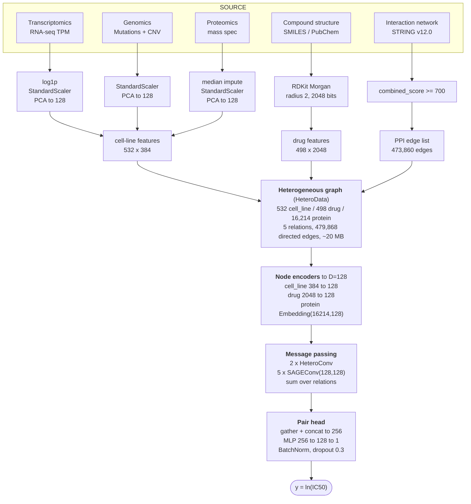
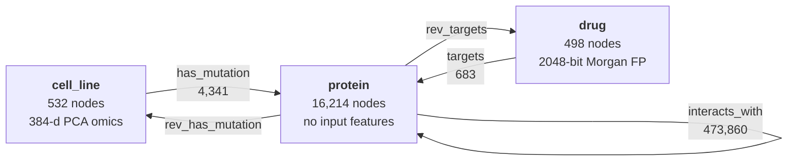
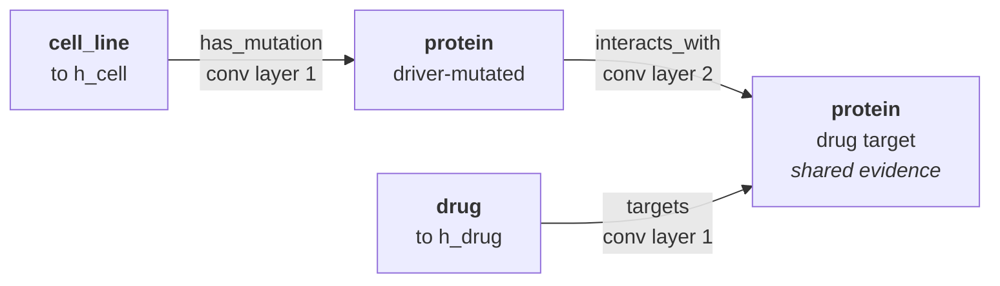

# System Architecture — `HeteroIC50GNN` (E11)

**Tracked result:** test RMSE **1.3301**, PCC **0.8805**, R² 0.7682, AUC 0.9129,
F1 0.8366 · 2,815,489 parameters · best epoch 19 · 114 s fit
(`experiments/07_gnn_ablation/hetero_ic50_gnn_results.csv`).

This is the reference description of the architecture as it actually exists in
code, written at the level MoGraphDRP §2 and AMOGEL §3 describe theirs: one
subsection per stage, every tensor shape stated, every hyperparameter named.
It is the source of truth for the architecture figure in the report.

---

## 0. Problem formulation

Given a cell line *c* with a multi-omics profile and a drug *d* with a chemical
structure, predict the natural-log half-maximal inhibitory concentration:

$$\hat{y}_{c,d} = f_\theta(\mathbf{x}_c,\ \mathbf{x}_d,\ \mathcal{G})$$

where $\mathcal{G}$ is a fixed heterogeneous biological graph shared across all
pairs. Trained on 111,799 (cell line, drug) pairs spanning 532 cell lines and
498 drugs.

Unlike a flat concatenation baseline, $f_\theta$ conditions each pair on the
graph: the cell-line and drug embeddings are refined by message passing over a
protein interaction network before they are ever combined.

---

## 1. Architecture at a glance

Rendered version of every figure in this document:
<https://claude.ai/artifact/XC9PnQBGxacYkit3oE3DDD>

### 1.1 End-to-end pipeline



The three input lanes never merge as vectors. Omics and fingerprints become
*node features* on a graph that also carries the STRING network, so every
prediction is conditioned on biological topology rather than on a flat
concatenation. The graph is built once offline and held in memory; only the
(cell line, drug) label pairs are mini-batched.

### 1.2 Graph schema



Five relations, each with its own convolution weights. The two cross-type
relations are mirrored at load time so information flows in both directions.
STRING already lists both directions of every interaction, so
`interacts_with` needs no manual mirroring.

### 1.3 Why the model is exactly two layers deep



Layer 1 moves mutation status and drug-target status onto the protein nodes.
Layer 2 propagates one hop along the PPI network — the only hop that lets a
cell line's mutated protein and a drug's target protein become the *same*
evidence — and carries the result back out to `cell_line` and `drug`. A third
layer over a 474K-edge network over-smooths.

---

## 2. Stage-by-stage specification

### 2.1 Data ingestion and ID harmonisation
**Code:** `src/data/ingest_and_align.py`, `src/data/build_wide_matrices.py`

Three identifier systems have to be reconciled before anything else can happen:
CCLE/DepMap ships Sanger Cell Model Passport IDs (`SIDM*`), GDSC keys its
dose-response table on `COSMIC_ID`, and DepMap's own crosswalk uses `ACH-*`.
All tables are mapped onto a single `standard_model_id` via `Model.csv`. Output
is one tidy row per cell line per omics table, and one row per
(cell line, drug) for the GDSC2 responses.

| Source | Contribution |
|---|---|
| CCLE/DepMap `OmicsExpressionProteinCodingGenesTPMLogp1.csv` | transcriptomics |
| CCLE/DepMap `OmicsSomaticMutations.csv` + `OmicsCNV.csv` | genomics (Mut + CNV) |
| DepMap/ProCan proteomics matrix | proteomics |
| Sanger GDSC2 `fitted_dose_response` | ln(IC50) labels |
| STRING v12.0 `9606.protein.links` | PPI topology |
| PubChem PUG REST | SMILES (420/542 drug names resolved, 77.5%) |

### 2.2 Per-modality preprocessing and PCA compression
**Code:** `src/data/omics_preprocessing.py` (`OmicsPreprocessingPipeline`)

Each modality gets its **own** `sklearn.Pipeline`, fitted independently, so the
exact training-time transform can be replayed at inference (`joblib` artifacts
under `models/omics_pca/`) with no train/inference skew:

| Modality | Pipeline | Output |
|---|---|---|
| Transcriptomics (GE) | `log1p` → `StandardScaler` → `PCA(128)` | (532, 128) |
| Genomics (Mut + CNV) | `StandardScaler` → `PCA(128)` | (532, 128) |
| Proteomics | median `SimpleImputer` → `StandardScaler` → `PCA(128)` | (532, 128) |

The three blocks are concatenated along the feature axis:

$$\mathbf{x}_c = [\mathbf{z}^{GE}_c \,\|\, \mathbf{z}^{MutCNV}_c \,\|\, \mathbf{z}^{Prot}_c] \in \mathbb{R}^{384}$$

All 532 cell lines survive the three-way inner join — nothing is dropped.

> **Deviation from AMOGEL / MoGraphDRP — state this explicitly in the report.**
> Both benchmarks perform *biological* feature selection (AMOGEL via association
> rule mining, MoGraphDRP by restricting to ~600–700 COSMIC cancer genes). This
> architecture uses blanket PCA instead. PCA preserves variance but destroys
> gene identity on the cell-line side, which is why interpretation
> (`src/interpretation/`) operates on the graph rather than on the input vector.

### 2.3 Chemical representation
**Code:** `src/data/fetch_drug_smiles.py`, `src/data/03_graph_construction.py`

SMILES are fetched once from PubChem and cached to
`data/raw/pubchem/gdsc_drug_smiles.csv`, then converted by RDKit
(`rdFingerprintGenerator.GetMorganGenerator`) into **Morgan fingerprints,
radius 2, 2048 bits**. Drugs whose SMILES fail to parse get no node, which is
what fixes the population at 498 drugs and 111,799 labelled pairs.

$$\mathbf{x}_d \in \{0,1\}^{2048}$$

> **Deviation.** MoGraphDRP encodes the drug as a *molecular graph* through a
> GCN, and additionally concatenates three fingerprint types. E11 uses the
> fingerprint only. The molecular-graph variant exists in this project
> (`src/models/drug_gcn.py`, `src/models/full_architecture.py`) and scored
> *worse* (1.3397, `docs/12_full_architecture_results.md`) — report it as a
> tested-and-rejected alternative, not as a missing feature.

### 2.4 Heterogeneous graph construction
**Code:** `src/data/03_graph_construction.py`, `src/data/04_link_cell_lines.py`

A single `torch_geometric.data.HeteroData` object, ~20 MB of tensors, shared by
every training step — it is built once offline, not rebuilt per batch.

**Nodes**

| Type | Count | Feature dim | Source |
|---|---|---|---|
| `cell_line` | 532 | 384 | §2.2 |
| `drug` | 498 | 2048 | §2.3 |
| `protein` | 16,214 | — (placeholder zeros) | STRING ENSP identifiers |

**Edges**

| Relation | Count | Construction rule |
|---|---|---|
| `(protein, interacts_with, protein)` | 473,860 | STRING v12.0, `combined_score >= 700` (high-confidence cutoff). Verified already symmetric in the source file, so no manual mirroring. |
| `(drug, targets, protein)` | 683 | GDSC `TARGET` free-text column → gene symbol → ENSP via the STRING alias file. 266/380 symbol tokens resolved. |
| `(cell_line, has_mutation, protein)` | 4,341 | Cell line linked to a protein iff the gene carries a **cancer-driver** mutation in that cell line. Covers 526/532 cell lines. |
| `(protein, rev_targets, drug)` | 683 | Built at load time by flipping `targets`. |
| `(protein, rev_has_mutation, cell_line)` | 4,341 | Built at load time by flipping `has_mutation`. |

Two design points worth defending in the report:

1. **Driver-only mutation edges.** The raw mutation table averages ~6,300
   mutations per cell line, overwhelmingly intronic. Linking all of them would
   add millions of noise edges that swamp the 474K high-confidence PPI edges.
   The `cancer_driver` flag (~0.3% of rows) is the biologically motivated
   sparse subset. Ablating these 4,341 edges costs ~0.05 RMSE
   (`docs/07_gnn_ablation_results.md`) — they are doing real work.
2. **No label leakage.** Mutation edges derive from mutation status only, never
   from IC50, so graph construction is independent of the target.

### 2.5 Node encoders
**Code:** `src/models/train/hetero_gnn.py::HeteroIC50GNN.__init__`

Node types arrive with mismatched dimensionality (384 / 2048 / none), so each is
projected onto a shared hidden width **D = 128**:

$$\mathbf{h}^{(0)}_c = \mathrm{ReLU}(W_c \mathbf{x}_c + b_c), \qquad
\mathbf{h}^{(0)}_d = \mathrm{ReLU}(W_d \mathbf{x}_d + b_d), \qquad
\mathbf{h}^{(0)}_p = E[p]$$

**Why proteins get an `nn.Embedding` and not a `Linear`.** Protein node features
on the graph are all-zero placeholders. A `Linear` applied to an all-zero vector
returns the bias for *every* protein — all 16,214 proteins would enter message
passing with an identical, non-identifying embedding, and no notion of *which*
protein a drug targets could ever propagate. A learnable
`nn.Embedding(16214, 128)` gives each protein its own trainable identity,
supervised end-to-end by the IC50 loss. This single choice accounts for
2,073,792 of the model's 2,815,489 parameters (74%).

### 2.6 Relational message passing
**Code:** `HeteroIC50GNN.forward`

Two `HeteroConv` layers. Each layer instantiates **one `SAGEConv(128, 128)` per
relation** — five in total, with independent weights — and aggregates the
per-relation outputs at each destination node by **sum**, followed by ReLU:

$$\mathbf{h}^{(l+1)}_v = \mathrm{ReLU}\!\left( \sum_{r \in \mathcal{R}(v)} \mathrm{SAGE}^{(l)}_r\!\left( \mathbf{h}^{(l)}_v,\ \{\mathbf{h}^{(l)}_u : u \in \mathcal{N}_r(v)\} \right) \right)$$

Node types that receive no message in a given layer carry their previous
embedding forward unchanged.

**Why `SAGEConv` and not `GCNConv`.** `GCNConv` normalises by node degree over a
single node set and assumes a symmetric, same-node-type graph. Three of the five
relations here are *bipartite* (cell_line→protein, drug→protein), which
`SAGEConv` handles natively through its `(src, dst)` tuple input dims.

**Why 2 layers.** Exactly enough hops to complete the intended reasoning path:
layer 1 moves mutation and drug-target signal onto the protein nodes; layer 2
propagates it one hop along the PPI network and back out to `cell_line` and
`drug`. A third layer over a 474K-edge PPI network over-smooths.

**Why not GAT.** Tested three times independently and lost each time
(`docs/07_gnn_ablation_results.md`); MoGraphDRP's own Table 3 reports the same
finding on their graphs. Document it as a measured deviation, not an omission.

**Full-batch, not sampled.** The whole graph is ~20 MB, so message passing runs
over all nodes every step and only the (cell line, drug) *label pairs* are
mini-batched. This keeps the model inside the project's 4–8 GB VRAM envelope
with no neighbour-sampling machinery.

### 2.7 Pair assembly and regression head

For a mini-batch of *B* index pairs (i, j), the refined embeddings are gathered
and concatenated:

$$\mathbf{z}_{ij} = [\mathbf{h}^{(2)}_{c_i} \,\|\, \mathbf{h}^{(2)}_{d_j}] \in \mathbb{R}^{256}$$

then passed through a three-layer MLP with BatchNorm and dropout 0.3:

$$256 \rightarrow 256 \rightarrow 128 \rightarrow 1$$

Output is a scalar ln(IC50) per pair.

> **Deviation.** MoGraphDRP's stated key innovation is a **multi-head bilinear
> attention** head in place of concat→MLP. E11 uses plain concatenation. This is
> the single most defensible "future work" item, and it is ~50 self-contained
> lines (`docs/CURRENTPLAN.md`, Tier 2 item 4).

---

## 3. Training protocol

| Component | Setting |
|---|---|
| Loss | MSE on ln(IC50) |
| Optimiser | `AdamW`, lr `1e-3`, weight decay `1e-4` |
| LR schedule | `ReduceLROnPlateau(mode='min', factor=0.5, patience=5)` on val RMSE |
| Batch size | 1024 label pairs (`drop_last=True`, so BatchNorm never sees a 1-sample batch) |
| Graph batching | full-batch every step |
| Max epochs | 200 |
| Early stopping | patience 15 on val RMSE, improvement threshold 1e-4 |
| Checkpoint criterion | **best validation RMSE** (not Pearson r — see below) |
| Seed | 42 |

**Checkpointing on RMSE is load-bearing, not incidental.** Validation Pearson r
keeps improving well past the point where the model starts overfitting, because
predictions stay directionally correlated while becoming miscalibrated in
magnitude. Selecting on r kept a badly overfit epoch and cost ~0.16 RMSE
(1.5654 → 1.4050); adding the LR scheduler on top took it to 1.3301.

### 3.1 Split protocol
**Code:** `src/data/experiment_utils.py::grouped_split`

`GroupShuffleSplit` **grouped by cell line**, 70/15/15, `random_state=42`, with a
post-split assertion that no cell line appears in two splits
(77,668 / 17,291 / 16,840 pairs). A plain random split over pairs leaks — the
same cell line lands in train and test paired with different drugs, and the
model partly looks it up rather than generalising. This protocol is shared code
across every row of `docs/results.md`, which is what makes 1.3301 comparable
rather than merely similar-looking.

### 3.2 Metrics
`evaluate()` reports RMSE, MAE, R², Pearson r and Spearman ρ on the regression,
plus AUC and F1 after binarising at the **median ln(IC50) across all targets** —
a shared threshold computed once, not per split.

---

## 4. Parameter budget

| Component | Parameters | Share |
|---|---|---|
| `protein_embedding` — `Embedding(16214, 128)` | 2,073,792 | 73.7% |
| `conv1` + `conv2` — 10 × `SAGEConv(128, 128)` | 328,960 | 11.7% |
| `drug_proj` — `Linear(2048, 128)` | 262,272 | 9.3% |
| `predictor` — MLP head with BatchNorm | 99,585 | 3.5% |
| `cell_proj` — `Linear(384, 128)` | 49,280 | 1.8% |
| **Total** | **2,815,489** | |

Worth naming in the report: three quarters of the model is a lookup table over
protein identity, learned from IC50 supervision alone. That is simultaneously
the architecture's most interesting property and its biggest risk — it is where
a future improvement (initialising protein embeddings from sequence or pathway
features instead of randomly) would have the most leverage.

---

## 5. Reproduction

```
python src/data/ingest_and_align.py          # ID crosswalk, tidy tables
python src/data/build_wide_matrices.py       # wide per-modality matrices
python src/data/00_run_preprocessing.py      # scale + PCA(128) per modality
python src/data/fetch_drug_smiles.py         # PubChem SMILES cache
python src/data/fetch_string_aliases.py      # STRING alias file
python src/data/03_graph_construction.py     # nodes + PPI + drug-target edges
python src/data/04_link_cell_lines.py        # cell_line -> protein mutation edges
python experiments/07_gnn_ablation/hetero_ic50_gnn_matrix.py   # train + evaluate
```

---

## 6. How this compares to the two benchmarks

| Axis | MoGraphDRP | AMOGEL | **This model (E11)** |
|---|---|---|---|
| Omics fusion | concat of COSMIC-filtered branches | association-rule mining → knowledge graph | PCA(128) per modality → concat(384) |
| Feature selection | ~600–700 COSMIC cancer genes | ARM-derived rules | none (blanket PCA) |
| Drug representation | molecular graph GCN + 3 fingerprint types | — | Morgan FP, radius 2, 2048 bits |
| Biological prior | drug molecular topology | mined rule graph | STRING PPI, score ≥ 700 |
| Message passing | GCN on molecular graph | GNN on rule graph | 2 × HeteroConv / SAGEConv on a tri-partite graph |
| Pair head | multi-head bilinear attention | MLP | concat → MLP(256, 128) |
| Split | random over pairs | — | **cell-line-grouped** (stricter) |

The split difference is the one to lead with when a reviewer asks why the RMSE
is not competitive with MoGraphDRP's published figure:
`docs/09_split_protocol_comparison.md` measures the gap attributable to protocol
alone.

---

## 7. Known gaps

- Cell lines are reachable *only* through the 4,341 driver-mutation edges — 6 of
  532 cell lines have none and stay disconnected.
- Protein nodes have no intrinsic features; their embeddings are learned purely
  from IC50 supervision.
- E11 still does not beat the flat MLP baseline (E04, 1.2843) on the same split.
  It is the best *graph* model in the project, which is a narrower claim and
  should be stated as such.
